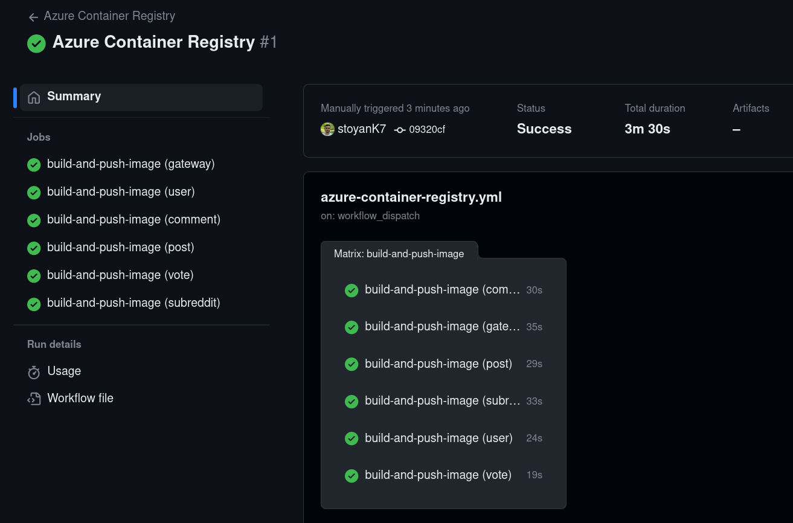
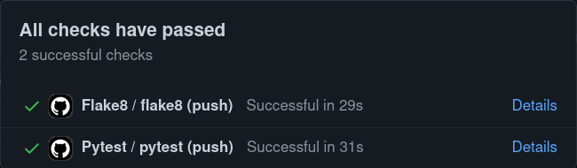

# CI/CD Pipeline

The purpose of this document is to show the history of the CI/CD pipeline for the project. Latest
is always on the top.

## 14 April 2023 (Latest)

The project now has a workflow to build and push the Docker images to Azure Container Registry.

## 17 March 2023

The pipeline is triggered by a push to the `main` branch and is composed of 2 workflows:

- `Pytest`: Runs the unit tests.
- `Flake8`: Runs the linter.

