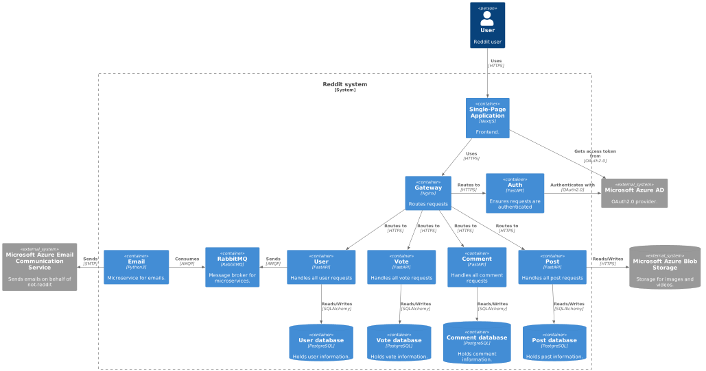
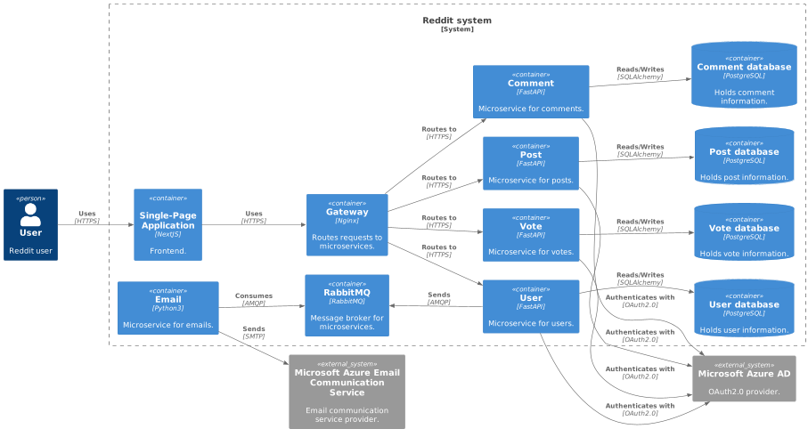
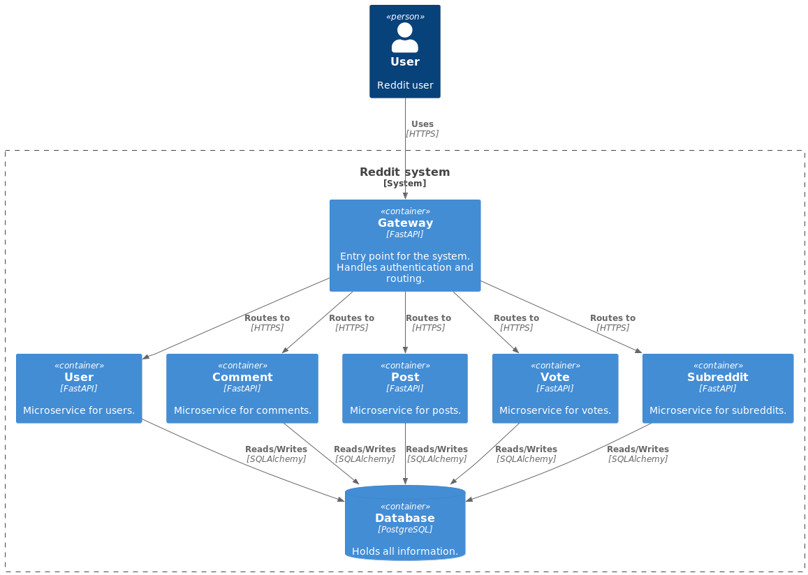
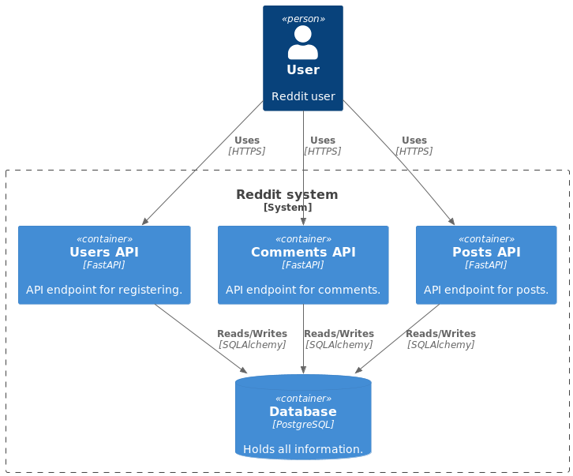
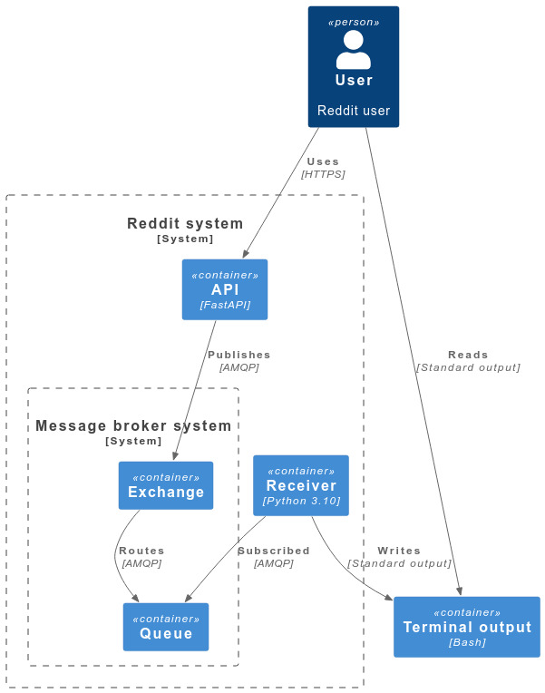

# Architecture

This document describes the history of the architecture of the project. Latest is always on the top.

## 25 April 2023 (Latest)

The gateway now checks the tokens instead of the microservices. The tradeoff is that I need to tell
it what it needs to check instead of doing it in the microservice itself, so it is a bit more work.
Moreover, the post microservice uses Azure Blob Storage for storing images and videos. See decision
record for [08. Azure Blob Storage](decisions/api/08-azure-blob-storage.md) for more details.

## 22 April 2023

The gateway has been migrated to nginx for performance increase and development simplicity. Each microservice now has
its own database. Moreover, there is an email service which is subscribed to a _RabbitMQ_ queue and sends emails
using _Microsoft Azure Email Communication_ service. In addition, every microservice validates the JWT token
by making a request to _Azure Active Directory_.
See [07. Database per microservice](decisions/api/07-database-per-microservice.md) for more details.

## 11 April 2023

The application has a single point of entry, the API gateway. It is responsible for routing the
requests and for authentication. The subreddit and vote services are now implemented:
See [06. Decision record for API Gateway](decisions/api/06-api-gateway.md) and
[05. Decision record for Votes](decisions/api/05-votes-microservice.md) for more details.

## 18 March 2023

Three API endpoints for users, comments and posts. See
[03. Microservice containers](decisions/api/04-microservice-containers.md) for more details.:

## 5 March 2023

Initial walking skeleton:

