# Autoscaling experimentation

The purpose of this document is to describe the process of experimentation with autoscaling in
Kubernetes. The goal is to find the best configuration for autoscaling the post service since it is
expected to be the most resource intensive service.

## Setup

Initially, the cluster is running 1 pod per deployment.

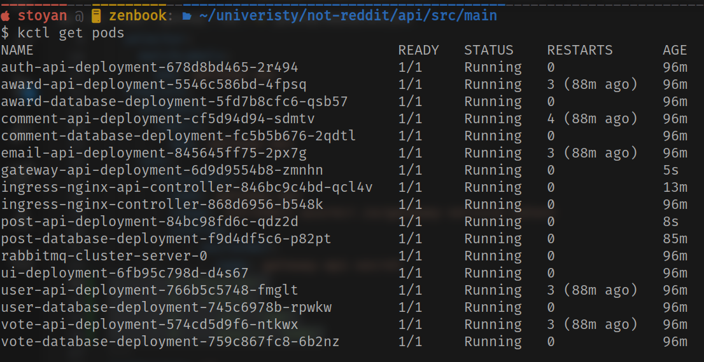

The tested endpoint
is `https://notredditapi.switzerlandnorth.cloudapp.azure.com/api/post?sort_by=hot&page=0` and the
response looks as follows

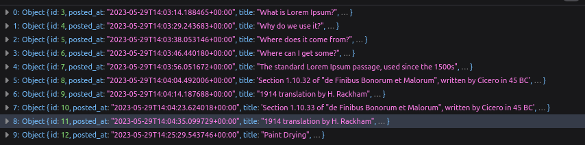

For this test I experimented a bit and found out that 2500 users with ramp-up period of 10 seconds
is a good configuration for the load test.

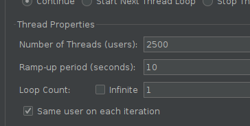

## First run on single pod

The initial run shows results of `200ms` in the first half of the responses but the remaining half
jumps to `1500ms` on average. This result was repeated multiple times.

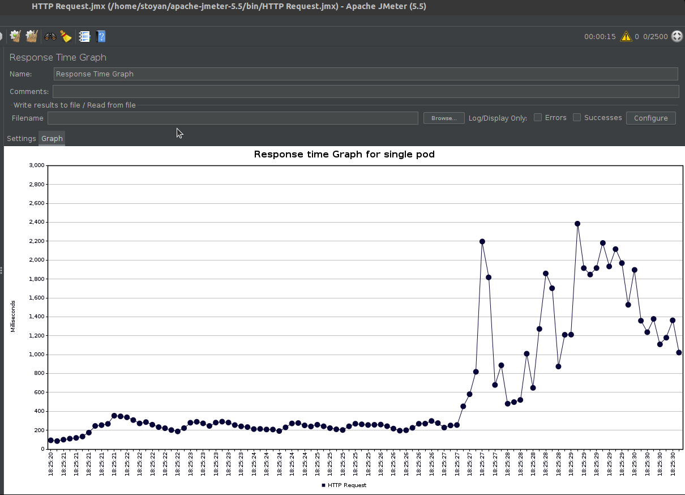

In the cluster monitoring a number of bottlenecks can be seen but the main ones
are `post-api-deloyment`, `gateway-api-deployment` and `ingress-api-deployment`.
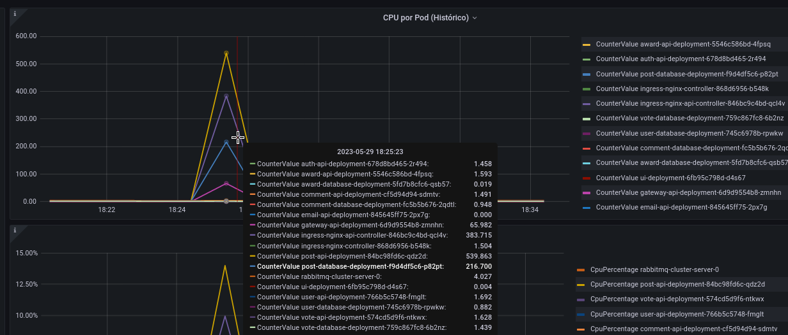

In terms of memory usage, only the `post-api-deployment` and the `ingress-api-deloyment` are seeing
a noticeable bump.

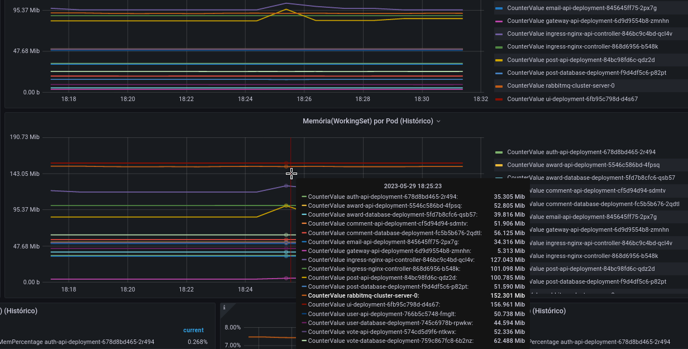

## Solution

The results above present an opportunity to scale the 3 deployments.

At first, I checked the pod usage at idle.

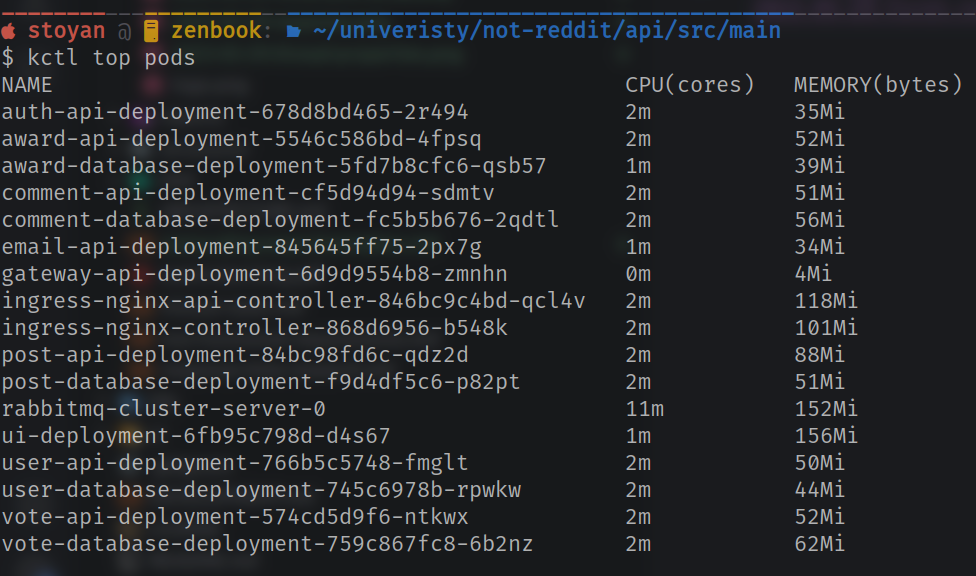

Then I configured the 3 deployments to have a horizontal autoscaler. I went with 50 percent average
CPU utilization as the target. If I did more experiments this number can be tweaked better.

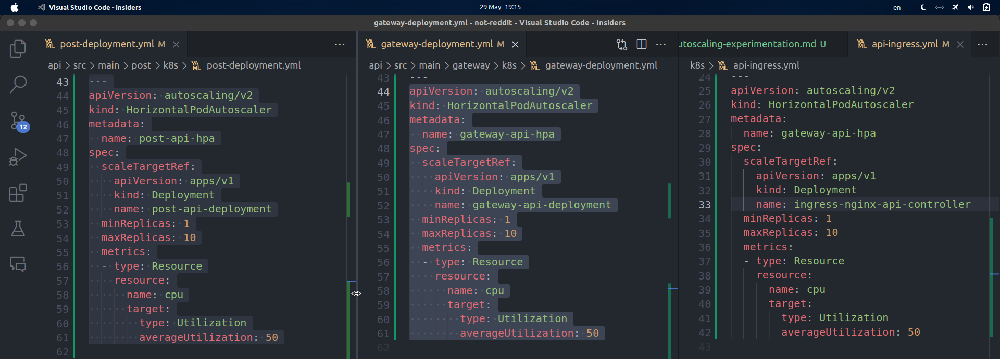

Then I checked that the autoscalers are working as expected.

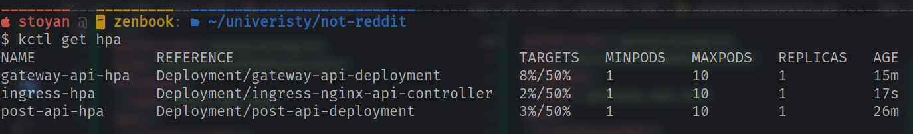

## Second run

This run shows the autoscalers kicking in mid-test. The flattening of the response times corresponds
to the time when the autoscalers created more pods.

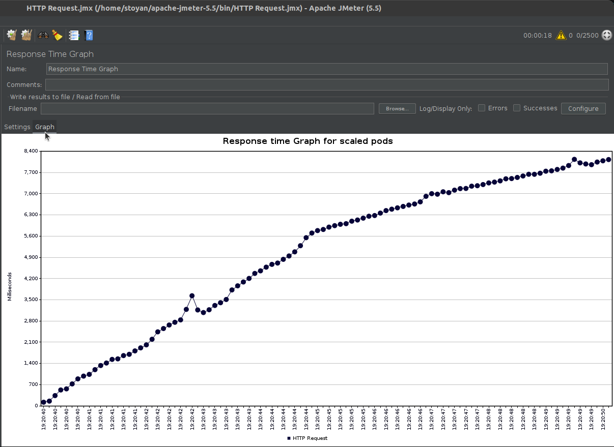

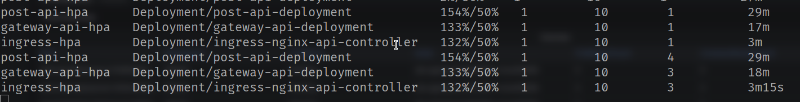

## Third run

This is the final run. The response times are now stable and much lower. Consecutive runs showed
even better and stable response times.

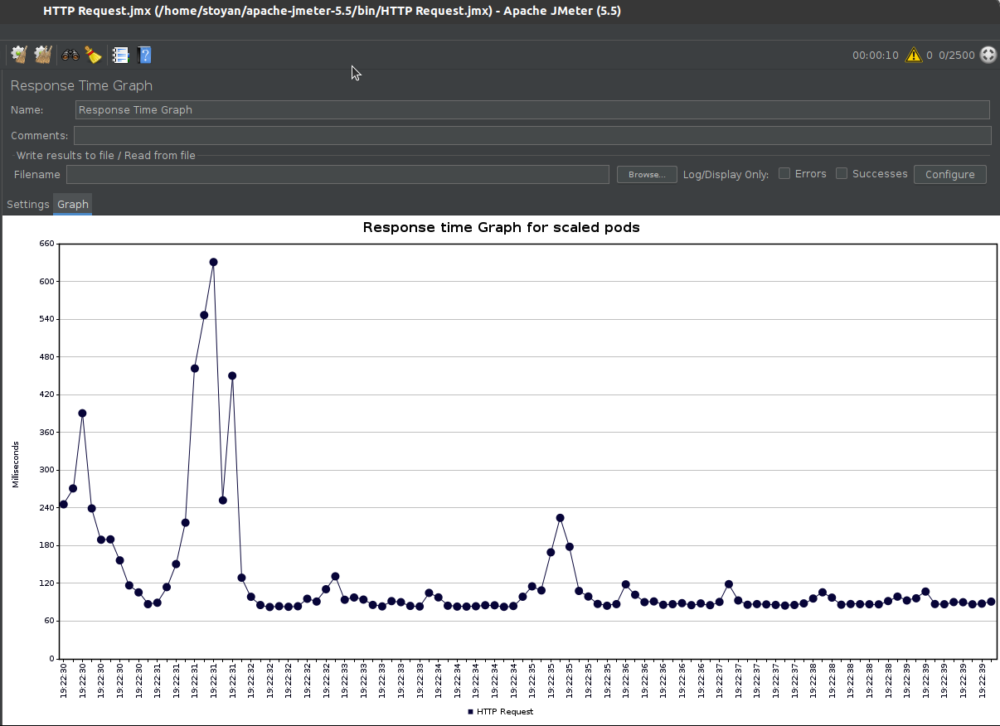

The image below shows how the autoscalers kicked in and increased the number of pods.

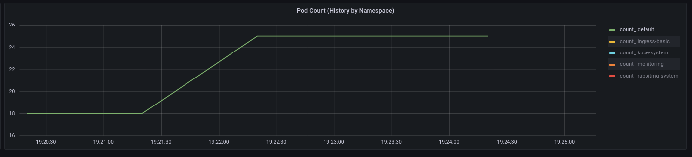

The image below shows the even distribution of CPU usage between pods.

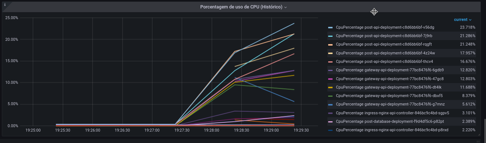

