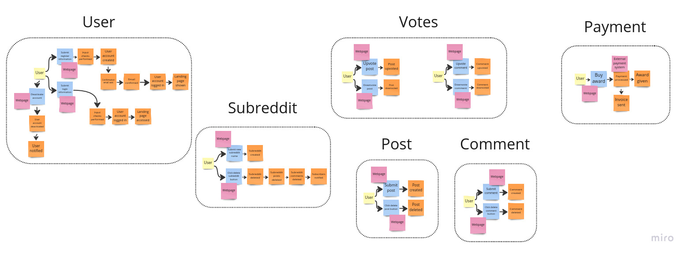

# Votes as microservice

## Status

Accepted.

## Context

An event storming session was performed and the following aggregates were identified:

One could argue that `votes` are not an aggregate and their responsibility could be delegated to the
`posts` and `comments` aggregates. However, a decision was made to keep them as a separate aggregate
because this way we can easily scale the voting system independently of the posts and comments. It
is not uncommon for a `post` to receive tens of thousands of votes in 24 hours. This would be a lot
of traffic for the `posts` and `comments` microservice to handle. The keyword here is
[Eventual Consistency](https://en.wikipedia.org/wiki/Eventual_consistency). We can afford to have
a few minutes of delay in the voting system and still provide a good user experience.

## Decision

The decision is to keep the `votes` as a separate microservice.

## Consequences

Scalability and performance should be improved when the system is under big load. However,
development time will be increased because an additial microservice has to be implemented.
Moreover, queues have to be implemented to ensure that the `votes` microservice is not overwhelmed
since we do not aim for immediate response.
