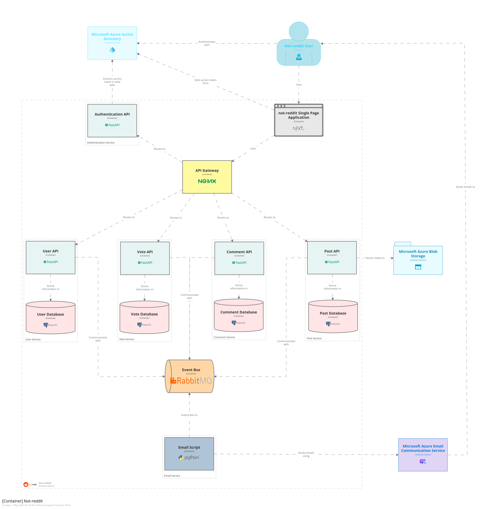

# Accelerating response times for high-traffic social media platforms

By Kostadinov, Stoyan S.L.

<!-- TOC -->
* [Accelerating response times for high-traffic social media platforms](#accelerating-response-times-for-high-traffic-social-media-platforms)
  * [Introduction](#introduction)
    * [Context](#context)
    * [Research questions and objectives](#research-questions-and-objectives)
    * [Methodology](#methodology)
    * [Constraints](#constraints)
    * [Glossary](#glossary)
  * [Literature review](#literature-review)
  * [Non-functional testing](#non-functional-testing)
  * [References](#references)
<!-- TOC -->

## Introduction

### Context

The majority of content on Reddit consists of text-based and media-based (videos and images) posts.
According to recent statistics, Reddit received an average of 30 billion monthly views in 2020,
making it the 6th largest social media platform in terms of
traffic.[[x]](https://www.businessofapps.com/data/reddit-statistics/)[[x]](https://www.similarweb.com/top-websites/computers-electronics-and-technology/social-networks-and-online-communities/)
As Reddit's revenue model heavily relies on
advertising[[x]](https://www.businessofapps.com/data/reddit-statistics/), the company stands to earn
more money with increased user visits to the platform.

Website speed is widely recognized as a crucial factor in user experience, with even a 1-second
delay in page load time leading to a 7% decrease in
conversions.[[x]](https://www.truconversion.com/traffic/decrease-page-load-time/)[[x]](https://cxl.com/blog/11-low-hanging-fruits-for-increasing-website-speed-and-conversions/)
When considering Reddit's annual revenue of $350
million[[x]](https://www.businessofapps.com/data/reddit-statistics/), this conversion loss
translates to a potential revenue loss of $24.5 million per year.

These factors clearly indicate that Reddit and other social media platforms have a strong incentive
to optimize their response times.

### Research questions and objectives

The goal of this research paper is to gain insight into different optimization techniques and
provide recommendations for the _not-reddit_[[x]](https://github.com/stoyanK7/not-reddit/) social
media platform.

> _not-reddit_ is a social news aggregation platform with sub-communities, messaging, and awards
> that allows users to post and share content, vote on submissions, and comment on posts.

---

> _**How can response times for the not-reddit social media platform be accelerated?**_

In order go get a better understanding of the problem, the following sub-questions will be
addressed:

> - _How does a request at not-reddit currently look like?_
> - _How does a request at not-reddit currently perform?_
> - _What performance-improving techniques do major social media platforms use?_
> - _How can the impact different techniques' be measured and evaluated?_

### Methodology

To achieve the research objectives and address the research questions, the following methodology
will be employed:

1. **Literature study** - A literature review will be conducted to gain insight into the
   performance-improving techniques used by major social media platforms.
2. **Non-functional testing** - A series of non-functional tests will be conducted to measure the
   performance of the not-reddit platform before and after applying the performance-improving
   techniques.
3. **IT architecture sketching** - A sketch of the not-reddit IT architecture will be created to
   identify the components that can be optimized.

> Note: The above methods are taken from ICT Research
> methods.[[x]](https://ictresearchmethods.nl/Methods)

### Constraints

The research is constrained by the following factors:

- **Time**\
  The research is limited to 3 weeks.
- **Resources**\
  The research is limited to the resources available to the author. All tests are ran from
  a `ASUSTeK COMPUTER INC. ZenBook UX434FLC_UX434FL` laptop with `8GB` of RAM and
  an `Intel(R) Core(TM) i7-10510U CPU @ 1.80GHz` processor.
- **Scope**\
  The research is limited to the not-reddit platform and does not consider other social media
  platforms.
- **Data**\
  The research is limited to the data available to the author. The not-reddit platform is a
  prototype and does not have any real users. The data used for the research is generated by
  the author.
- **Expertise**\
  The research is limited to the author's expertise. The author is a student with limited
  experience in the field of performance optimization.

### Glossary

| Term | Definition |
|------|------------|
| xxx  |            |

## Baseline

## Literature review

## Non-functional testing

## References

TODO
