# Security Testing

// TODO: Add table of contents

## Denial of Service (DoS)

The `https://notredditapi.switzerlandnorth.cloudapp.azure.com/api/post` endpoint is being tested. It
was filled with 10 post of relatively large size before the test. Below is a visualization of the
data that is being transferred at each request.

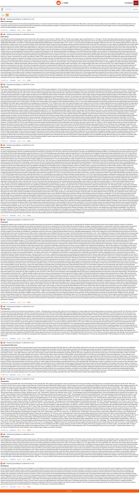

The DoS attack was peformed with _Apache JMeter_ by sending a thousand threads in the span of 10
seconds with each thread requesting forever.

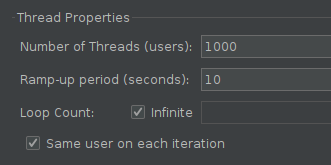

A total of `37030` requests were sent in the span of `3 minutes 54 seconds`.

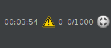

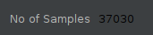

The graph below shows the response time results from the run.

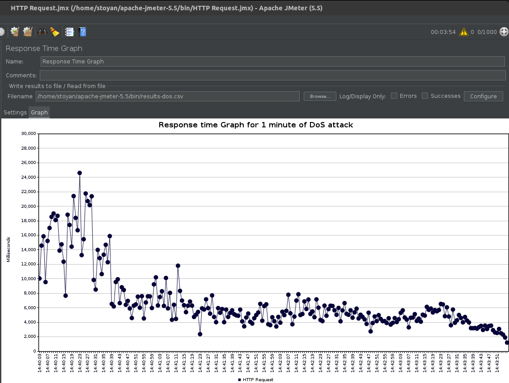
Some of the requests failed because the server was not able to handle the load but they were in
the `1-2%` range of the total requests.
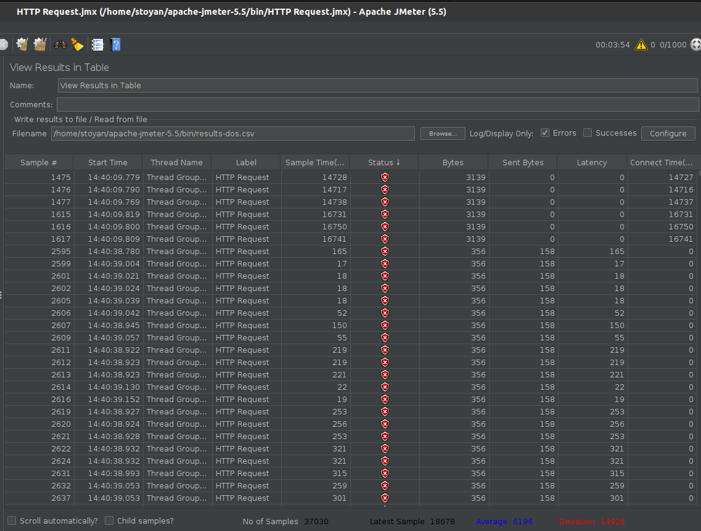

There is a noticeable drop in response time some 30 seconds into the test because Kubernetes
autoscaled the cluster to handle the load.

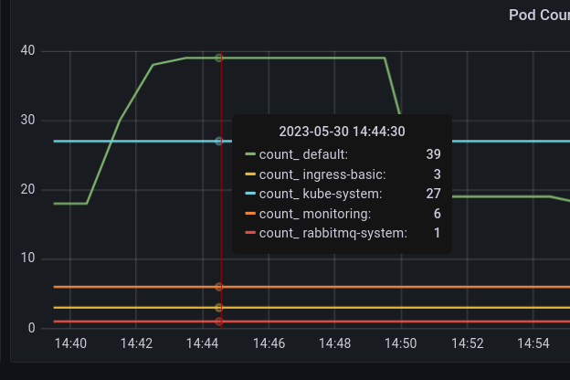
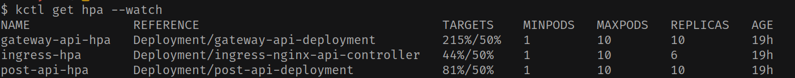

In conclusion, the server handled the load that was sent to it though response times were severely
hurt by the load. Normal times have been shown to be `200ms` but now the average was `6000ms`.
Unfortunately, I couldn't perform a DDoS attack since I was not in posession of multiple machines.

[The whole DDoS was recorded. Quality is a bit bad but I had to compress it since the original was 80+ MB.](img/DoS%20Attack_compressed.mp4)

### Mitigation

Even though results were not **that** bad, there are still some things that can be done to mitigate
the effects of a DoS attack.

I decided to put rate and connection limiting based off this
article: https://medium.com/@chadsaun/mitigating-a-ddos-attack-with-ingress-nginx-and-kubernetes-12f309072367

The limit is connections per IP to 2 and 120 requests per minute. 120 requests might be on the low
side but it's a good starting point. The limits can be changed in the future with testing if needed.

File: [api.ingress.yml](../k8s/api-ingress.yml)

```yaml
nginx.ingress.kubernetes.io/limit-connections: '2'
nginx.ingress.kubernetes.io/limit-rpm: '120'
```

To test if this does a better job, I ran a similar test as before. This time the amount of threads
was `2` since this is how many the ingress allows. The loop count was set to `150`. Theoretically,
we expect `1/3` of those requests to get refused.

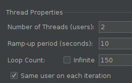

And this is what happened. Around the `261st` request, the rest were outright refused.

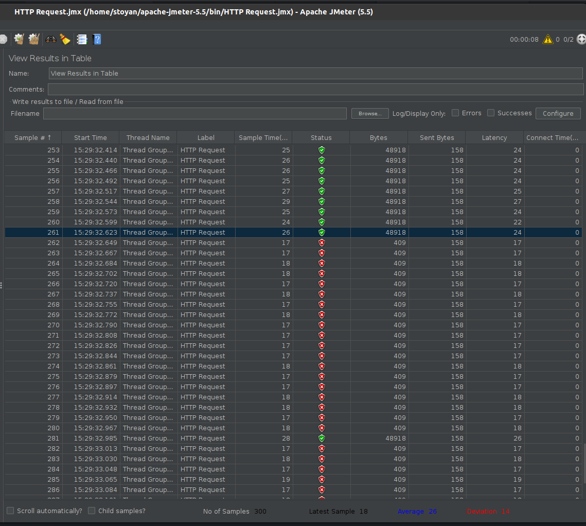

Below is the response time chart. An interesting drop in response time can be seen at the end. This
is when the requests were refused.

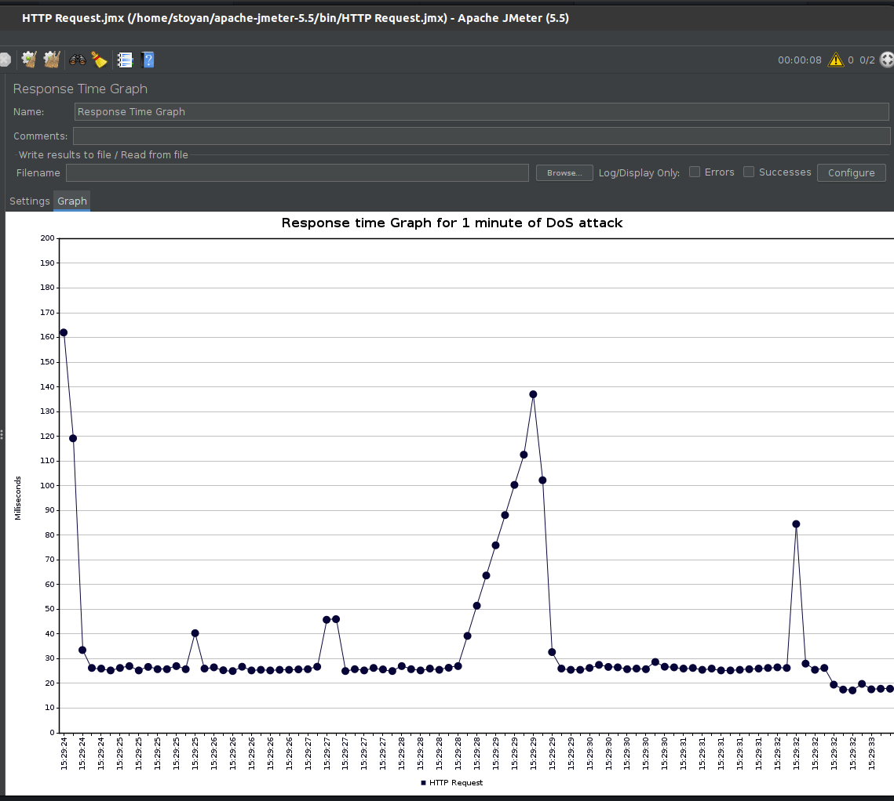

## SQL Injection

Right now I am not sanitizing my user inputs and I might be vulnerable to SQL injection attacks. I
am using _SQLAlchemy_ for all my database queries, and it is supposed to be safe from SQL injection
attacks - https://www.reddit.com/r/flask/comments/kvmhtz/comment/gizey1g/?utm_source=share&utm_medium=web2x&context=3.
Moreover, I am not using any stored procedures or crazy queries.
However, I am still going to test it. I followed the https://www.w3schools.com/sql/sql_injection.asp
tutorial to perform the attack.

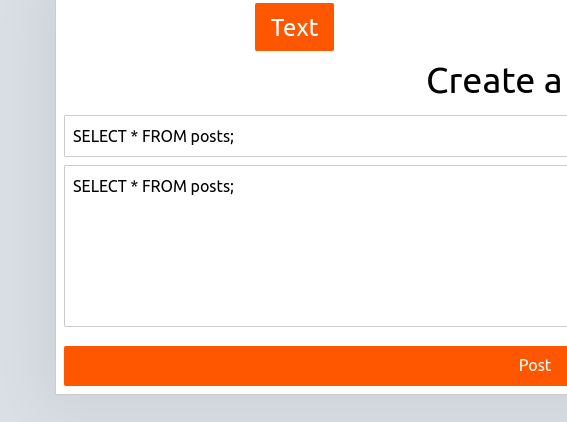

_SQLAlchemy_ successfully escaped the input.

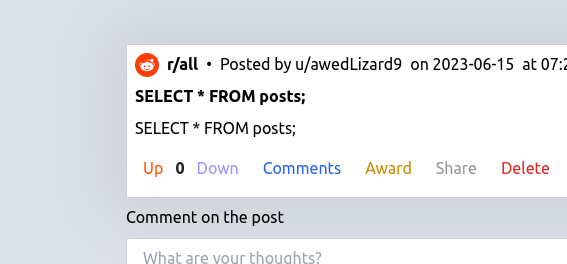

In addition, the automatic scan from _OWASP ZAP_ did not find any SQL injection vulnerabilities.

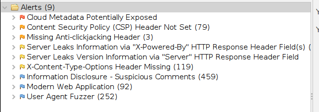

I am only doing get requests per _id_, deletions per _id_, and post requests with a JSON body but
the _id_ is generated from the database and not from the user. Therefore, I am not vulnerable to
attacks on a _WHERE_ clause.

I am attempting one more attack on the insert statement where I try to delete the whole table. The
attack was described at https://stackoverflow.com/a/681600/9553927
and https://portswigger.net/support/sql-injection-in-different-statement-types.

First I enabled logging for all queries, so I can see exactly what is being executed and craft a
better attack. I then inserted a post to see the query better:

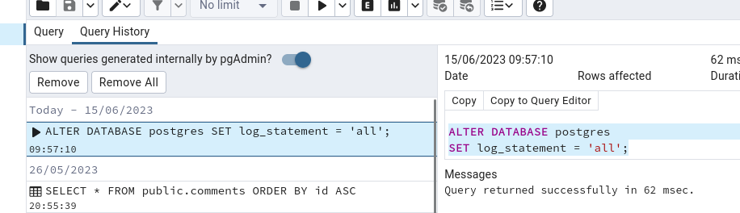

```
2023-06-15 08:02:47.978 UTC [35] LOG:  statement: INSERT INTO posts (title, body, username, post_type) VALUES ('HELLO WORLD', 'HELLO WORLD', 'solidHawk8', 'text') RETURNING posts.id, posts.posted_at, posts.votes, posts.silver_awards, posts.gold_awards, posts.platinum_awards
```

I know that the query starts as `INSERT INTO posts (title, body, username, post_type) VALUES ('` so
I tried to mess with the insert statement with the following
payload:`a', 'body', 'solidHawk8', 'text') -- -`. But _SQLAlchemy_ escaped the input again.

```
2023-06-15 08:10:23.350 UTC [37] LOG:  statement: INSERT INTO posts (title, body, username, post_type) VALUES ('a'', ''body'', ''solidHawk8'', ''text'') -- -', 'asdsd', 'solidHawk8', 'text') RETURNING posts.id, posts.posted_at, posts.votes, posts.silver_awards, posts.gold_awards, posts.platinum_awards
```

Finally, I looked through the _OWASP_ cheat sheet for SQL injection prevention, and I am not doing
anything that is considered bad practice - no stored procedures, no dynamic queries, no string
concatenation, etc..

https://cheatsheetseries.owasp.org/cheatsheets/SQL_Injection_Prevention_Cheat_Sheet.html

## XSS

Again, I am not validating user input, so I will try a XSS attack. I read how to do it at
https://owasp.org/www-community/attacks/xss/. _NextJS_ is safe from XSS attacks by default, so I
don't expect to find
anything. https://stackoverflow.com/questions/33644499/what-does-it-mean-when-they-say-react-is-xss-protected
describes the few scenarios where XSS attacks can happen in _React_, but I am not doing any of
those.

The simplest attack one can do is to add a `<script>alert("Hello there");</script>` in the body of a
post. The result is that the script is escaped and not executed.

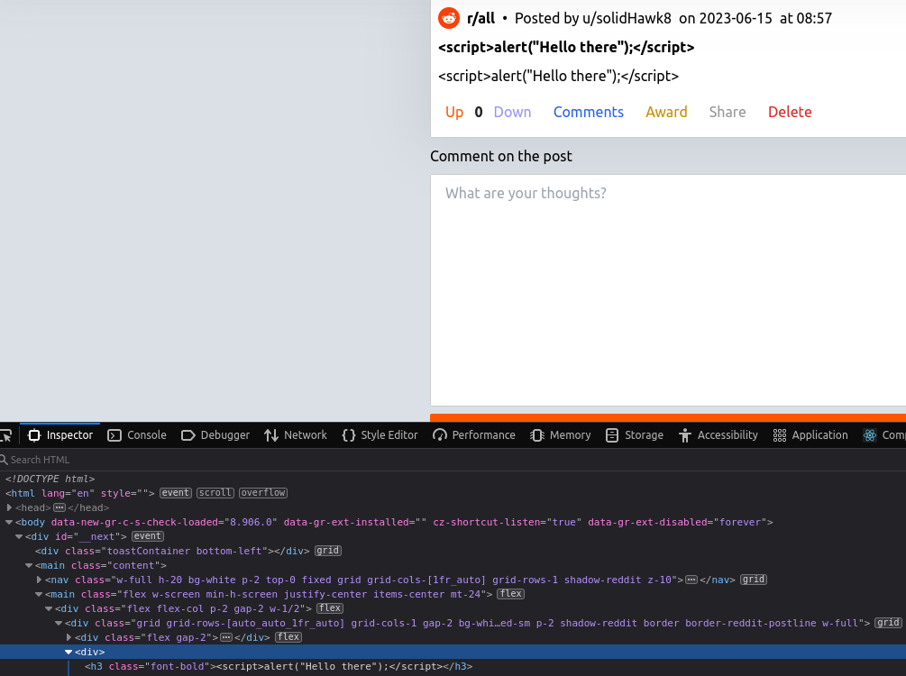

## OWASP ZAP Automatic scan

For the next attacks I used _OWASP ZAP_.

### Local

First I ran an automatic scan on `http://localhost:3000`


#### Cloud Data Potentially Exposed

This attack targeted my API Gateway on `http://localhost:8080` by trying to expose cloud data. From
_nginx_'s blog, the following configuration allows such attacks to happen.

https://www.nginx.com/blog/trust-no-one-perils-of-trusting-user-input/

```nginx
# Don't ever use 'proxy_pass' like this!
location / {
    proxy_pass http://$host; # To repeat: don't do this!
}
```

The attack was unsuccessful since I don't use such configuration and the tool got
a `308 Permanent Redirect` which in turn shows `404`.

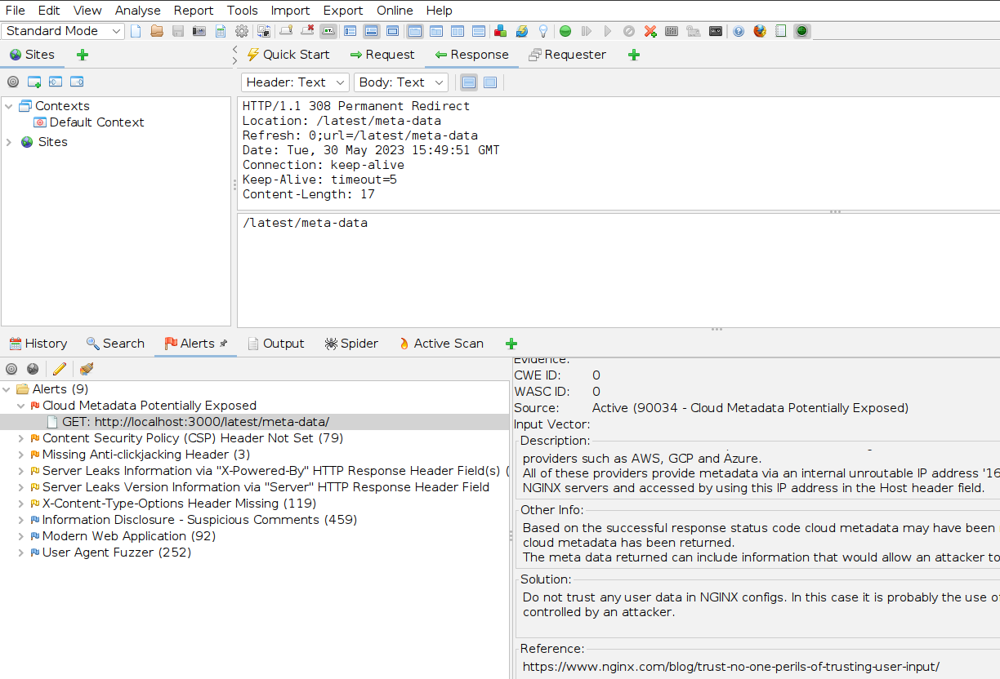
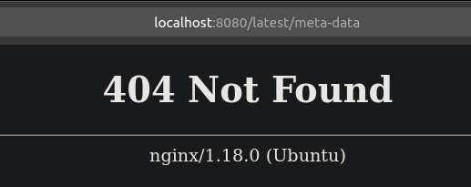

#### Content Security Policy (CSP) Header Not Set

The report shows that the CSP header is not set on neither the ui `http://localhost:3000` nor the
API `http://localhost:8080`.

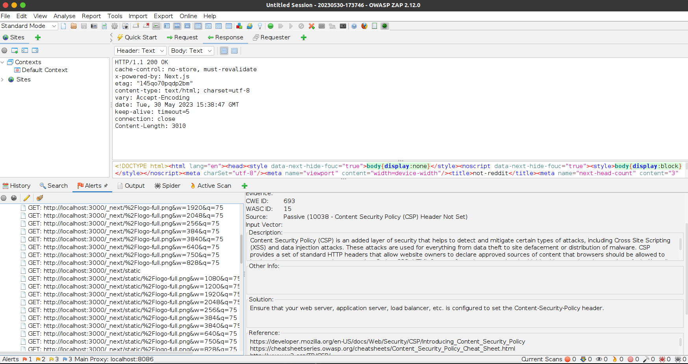

From https://developer.mozilla.org/en-US/docs/Web/HTTP/CSP it is clear that this opens up the
application to XSS attacks.

##### Mitigation

NextJS has documentation explaining how to set the CSP header so I followed it.

https://nextjs.org/docs/pages/api-reference/next-config-js/headers#content-security-policy

File: [next.config.js](../ui/src/main/next.config.js)

```js
const ContentSecurityPolicy = `
  default-src 'self' ${process.env.NEXT_PUBLIC_API_SERVICE_URL};
  script-src 'self' 'unsafe-inline' 'unsafe-eval' ${process.env.NEXT_PUBLIC_API_SERVICE_URL};
  style-src 'self' 'unsafe-inline' ${process.env.NEXT_PUBLIC_API_SERVICE_URL};
  img-src 'self' blob: data: ${process.env.NEXT_PUBLIC_API_SERVICE_URL};
  connect-src 'self' ${process.env.NEXT_PUBLIC_API_SERVICE_URL} login.microsoftonline.com;
  object-src 'self' ${process.env.NEXT_PUBLIC_API_SERVICE_URL};
  media-src 'self' ${process.env.NEXT_PUBLIC_API_SERVICE_URL};
  frame-src 'self' ${process.env.NEXT_PUBLIC_API_SERVICE_URL};
  font-src 'self' ${process.env.NEXT_PUBLIC_API_SERVICE_URL};
  form-action 'self' ${process.env.NEXT_PUBLIC_API_SERVICE_URL};
`;

const securityHeaders = [
    {
        key: 'Content-Security-Policy',
        value: ContentSecurityPolicy.replace(/\s{2,}/g, ' ').trim()
    },
```

Then I added a header to the API gateway too which is an nginx server.

https://content-security-policy.com/examples/nginx/
File: [nginx.conf](../api/src/main/gateway/nginx.conf)

```nginx
add_header Content-Security-Policy "default-src 'self';";
```

<!-- 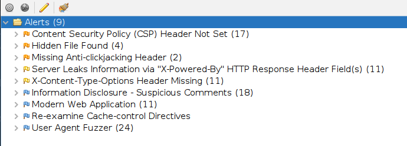 -->

